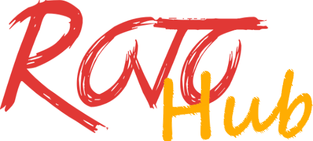
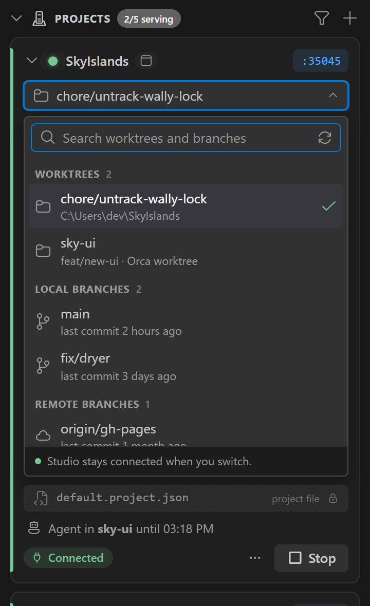

<p align="center"></p>

# Rojo-Hub

A VS Code extension that serves many [Rojo](https://rojo.space) projects at once, each on its own
fixed port, and switches any of them to another branch or worktree **without Studio disconnecting**.

**[Documentation](https://greenviper126.github.io/RojoHub/)** ·
[Install](https://greenviper126.github.io/RojoHub/guide/install) ·
[Changelog](CHANGELOG.md)

<p align="center"></p>

## What it does

- **One port per project, the same everywhere.** A project's port is worked out from its repo's
  first commit (or taken from `servePort` in its project file), so it is the same on every machine.
- **Studio connects by itself.** Rojo-Hub installs its own Studio plugin (Rojo's, changed to connect
  by itself). A place syncs with the project whose `servePlaceIds` lists it, or the one you assign it
  in the panel, and reconnects on its own after Rojo restarts. No port to type.
- **Live branch switching.** Pick a worktree or any branch. The same `rojo serve` keeps running and
  Studio receives the difference as one update.
- **Groups.** Start, stop or swap a whole set of projects at once, like a profile.
- **Built for agents.** Claude Code, Codex and VS Code agents can serve their own worktree to Studio
  through Rojo-Hub's MCP server, taking turns when several share one repo.
- **Always serving.** A small background service owns the Rojo processes, so closing or reloading
  VS Code windows does not stop anything. The panel follows it live.

## Requirements

- Windows 10 or 11.
- VS Code 1.101 or later.
- git 2.31 or later on `PATH`.
- [Rokit](https://github.com/rojo-rbx/rokit), with each project's pinned Rojo installed
  (`rokit install` in the project). Rokit also reads `aftman.toml` and `foreman.toml`.
- Rojo 7.7 or later. Rojo-Hub installs its own Studio plugin, built from Rojo 7.7's.

Details and setup steps: [Requirements](https://greenviper126.github.io/RojoHub/guide/requirements).

## Getting started

1. Download `rojo-hub-<version>.vsix` from [Releases](https://github.com/greenviper126/RojoHub/releases)
   and install it: *Extensions view → ⋯ → Install from VSIX…*, or
   `code --install-extension rojo-hub-<version>.vsix`. Each VS Code profile needs its own install.
2. Open the **Rojo-Hub** panel in the activity bar and press **+** to add a project folder.
3. Press **Start**. List your places in the project file's `servePlaceIds` (or assign them in the
   panel's **Studio places**), open them in Studio, and they sync by themselves.
4. Click the branch on the card to switch. Studio stays connected.

The VS Code Marketplace and Open VSX listings are coming soon.

## Develop

```sh
npm install          # building also needs Rojo 7.7.0 from Rokit, for the Studio plugin
npm run typecheck
npm test              # unit tests, bundle smoke test, end-to-end against a real Rokit-installed Rojo 7.7
npm run package       # rojo-hub-<version>.vsix
npm run docs:dev      # the documentation site (site/)
```

How it works inside, and why: [`docs/how-it-works.md`](docs/how-it-works.md) and
[`specs/`](specs/). The Studio plugin is in [`plugin/`](plugin/): Rojo's plugin with Rojo-Hub's
changes listed in [`plugin/UPSTREAM.md`](plugin/UPSTREAM.md).

## License

[MIT](LICENSE), except [`plugin/`](plugin/), which is Rojo's Studio plugin and stays under Rojo's
[MPL-2.0](plugin/LICENSE) (Rojo-Hub's own files in it are MIT). Not affiliated with Roblox or the Rojo
project.
