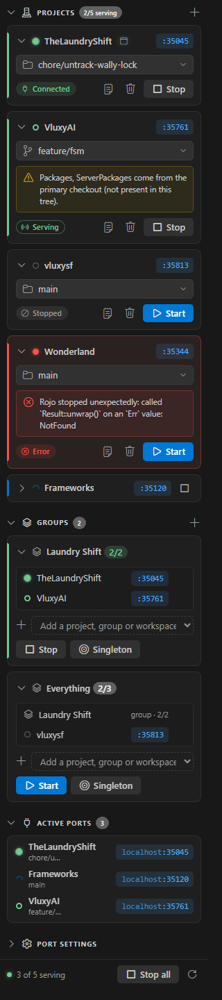
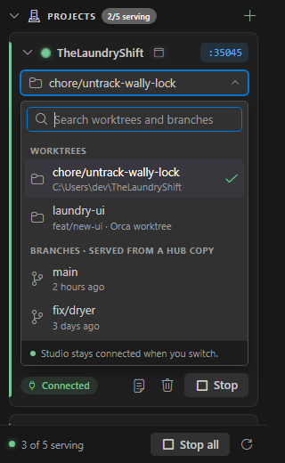

# How Rojo-Hub works

The complete description of Rojo-Hub as built: every feature, command and setting, what happens
underneath, where files live, and the known limits. It is written to be the source for user
documentation. Version 0.11.3, 2026-09-27. For why each design choice was made, with the
measurements behind it, see [`specs/001-rojo-hub-foundation.md`](../specs/001-rojo-hub-foundation.md).

## Contents

1. [What it does](#1-what-it-does)
2. [Concepts](#2-concepts)
3. [Install, update, uninstall](#3-install-update-uninstall)
4. [Where to find it in VS Code](#4-where-to-find-it-in-vs-code)
5. [Projects](#5-projects)
6. [Ports](#6-ports)
7. [Connecting Studio](#7-connecting-studio)
8. [Switching branches](#8-switching-branches)
9. [Groups](#9-groups)
10. [The background service](#10-the-background-service)
11. [Files on disk](#11-files-on-disk)
12. [Settings](#12-settings)
13. [Commands](#13-commands)
14. [Known limits and troubleshooting](#14-known-limits-and-troubleshooting)
15. [For developers](#15-for-developers)

---

## 1. What it does

Rojo-Hub is a private VS Code extension for Roblox developers who use Rojo and work on several
projects, or several branches of one project, at the same time.

- **Every project gets its own Rojo port**, and several projects can serve at once. Each Studio
  place connects to its project once; after that the Rojo plugin reconnects it by itself.
- **Any project can be switched to another branch or worktree while it is serving**, and Studio
  stays connected: it receives the difference as one update instead of disconnecting.
- **Projects can be grouped** so a set of them starts, stops, or takes over as a profile, together.

It works with Orca worktrees, showing them under Orca's names, and with plain
git branches and worktrees.

## 2. Concepts

| Term | Meaning |
|---|---|
| **Project** (in code: *slot*) | One registered Rojo project: a git repo with a project file, normally `default.project.json`. Identified by its Rojo project `name`. |
| **Port** | The TCP port the project's Rojo listens on, `localhost:<port>`. Fixed per project (see [Ports](#6-ports)). |
| **Target** | What the project is currently serving: a **worktree** (served in place) or a **branch** with no worktree (served from a *view*). |
| **Primary checkout** | The repo's main folder, the one other worktrees belong to. Registration always stores this, whichever worktree you registered from. |
| **View** | A folder Rojo-Hub creates to serve a branch nobody has checked out: a detached git worktree of that branch's commit, under `%LOCALAPPDATA%\RojoHub\views\`. |
| **Group** | A named set of projects started and stopped together, like a profile. |
| **Service** | A small background program that owns the projects and their Rojo processes, separate from VS Code windows. |
| **Session** | One run of `rojo serve`. The Studio plugin stays connected only while the session stays the same; restarting Rojo starts a new one. |

## 3. Install, update, uninstall

Rojo-Hub is distributed as a `.vsix` file, never through the marketplace.

**Build it** (from the RojoHub repo):

```sh
npm install
npm run package          # produces rojo-hub-<version>.vsix
```

**Install it** in VS Code: Extensions view → `…` → **Install from VSIX…**, or

```sh
code --install-extension rojo-hub-<version>.vsix --force
```

**VS Code profiles have separate extension lists.** The command above installs into the Default
profile only. Install into each profile you open Roblox projects in:

```sh
code --install-extension rojo-hub-<version>.vsix --force --profile "Roblox"
```

Then **reload the window** (`Ctrl+Shift+P` → *Developer: Reload Window*). A window that was open
during the install does not load the new version until it reloads.

**Update**: install the newer `.vsix` the same way and reload **every** window that has Rojo-Hub
(each window runs its own copy of the extension). A window only ever replaces the service with a
newer one, never an older one; a window still on the old version keeps using the newer service and
asks once to be reloaded. The new extension notices that the
running service is an older version, asks it to exit, and starts its own. Rojo processes keep
running through this, so Studio stays connected, and the new service adopts them.

**Requirements**: Windows; git on `PATH`; Rojo installed through [Rokit](https://github.com/rojo-rbx/rokit)
(each project's toolchain file picks its Rojo version, see [Projects](#5-projects)); Rojo 7.7 for
everything to work as described. Orca is optional.

**Uninstall**: press *Stop all*, uninstall the extension, then end the background service with
`curl -X POST http://127.0.0.1:34870/shutdown` (or sign out). Delete `%LOCALAPPDATA%\RojoHub\` to
remove its state and views.

## 4. Where to find it in VS Code

### The Rojo-Hub panel

An icon in the activity bar (a hub: one dot joined to four) opens the Rojo-Hub panel in the
sidebar. It opens by itself the first time Rojo-Hub runs in a VS Code profile. The panel is built
for Rojo-Hub and drawn in VS Code's theme colours and icons. Everything can be done from it; no
menus pop up at the top of the window.

| The panel (sample data) | Switching branch inside a card |
|---|---|
|  |  |

It has three sections that fold open and closed (the panel remembers which are folded), and a
footer:

**Projects** (the header shows how many are serving, and `+` adds a project). Each project is a
card:

- a **status light** and the project's **name** (a *this window* badge marks the project this VS
  Code window is open on; those come first);
- the **port** (`:35045`), which copies `localhost:35045` when clicked;
- **what it serves**: a folder icon for a worktree, a branch icon for a branch. Clicking it opens
  the branch picker inside the card: a search box, then *Worktrees* (under Orca's names) and
  *Branches*, with the current one ticked. Clicking one switches; Enter picks the first match,
  Escape closes it. Studio stays connected;
- a **status line**: *Studio connected*, *Serving · waiting for Studio*, *Starting…*, *Stopped* or
  *Error*;
- **warnings** (yellow) and **errors** (red), in full;
- **Start** or **Stop**, and buttons for the Rojo log, copying the address, and removing the
  project (which asks first).

Running projects have a green edge, and projects with an error a red one. With no projects, the
section explains what Rojo-Hub does and offers *Add a project* and the *Getting started guide*.

**Grouped by workspace.** When projects belong to a VS Code workspace (a `.code-workspace`
file), the Projects list groups them under that workspace's name, with its serving count, a *this
window* badge for the workspace this window has open, and a **Group** button that makes a group
of its projects. Folders the workspace lists that have a `default.project.json` but are not added
yet appear under it as *not added* with an **Add** button (and *Add all* when there are several).
Projects in no workspace are under **Other projects**. See [Workspaces](#workspaces).

**Add a project** (the `+`) opens a list inside the panel of the folders open in this window and the
repos Orca knows about, each with a `+`, and a *Browse…* button for any other folder. The new
project's card is highlighted once it is added.

**Groups** (the header shows how many; `+` makes one). *New group* opens a name box in the panel;
Enter or *Create* makes it. Each group is a card that folds open and closed, showing how many of its
projects are serving (green when all are). Inside:

- the groups inside it, then its projects, each with ✕ to take it out (clicking a name jumps to
  its card);
- an **Add a project, group or workspace…** dropdown: workspaces (adding each of their projects),
  projects not in it yet, then groups, with groups that would make a loop greyed out;
- **Start**, **Only this** (start this group, stop every other project; asks first, naming what it
  will stop) and **Stop** (keeps projects another running group uses);
- a green *running* badge while the group is running;
- ✎ rename (edit the name in place; Enter saves, Escape cancels) and 🗑 delete (asks *Delete?* in
  place; the projects stay).

**Port settings** (folded by default): the port range and excluded ports as text boxes, with
*Save* and *Undo*. Mistakes are pointed out before saving. The port range also has **Reset**, which
puts back the default range (34873–35872) after asking: it says how many projects get their port from
the range, since their ports may change and serving ones restart. Reset is greyed out when the range
is already the default; excluded ports have no reset. These edit the VS Code user settings described
in [Settings](#12-settings).

**Footer**: how many projects are serving, **Stop all**, and Refresh. *Stop all* stops every
serving project and marks every group not running; it asks first, on the panel, naming what it will
stop. The background service itself never appears: Rojo-Hub starts it whenever it is needed.

While an action runs, VS Code's progress bar shows at the top of the panel and the button that
started it is disabled.

### Other ways in

- **Rojo-Hub: Open Menu** (command palette, and the list icon in the panel's title bar): the same
  actions as quick-pick menus for keyboard use, like Rojo's own *Rojo: Open Menu*.
- **The status bar**: in a window whose folder belongs to a registered project, the bottom bar
  shows `Rojo :<port> · <what it serves>` with its state icon. Clicking it opens the panel and
  highlights that project's card.
- **Get Started walkthrough**: on VS Code's Welcome page (Help → Welcome, then *Get Started with
  Rojo-Hub*), or *Getting started guide* in the empty panel. Five steps: add, start, connect
  Studio, switch, group.

**Status lights**

| Light | Meaning |
|---|---|
| grey ring | stopped |
| spinner | starting |
| green ring | serving, no Studio plugin connected |
| green dot | serving, at least one Studio plugin connected |
| red dot | error (the card shows the message; the log has the rest) |
| dashed grey ring | unavailable: Rojo-Hub's service could not be started |

## 5. Projects

**Add a project** (the `+` on Projects) lists the folders open in the window and the repos Orca
knows about, and offers *Browse…*.
Any folder inside a repo works; the primary checkout is what gets registered. Registration fails
when:

- the primary checkout has no `default.project.json`, or it has no `name`;
- the repo is already registered;
- another project already uses the same Rojo project `name`. Names must be unique because the
  Studio plugin reconnects a place only to a server reporting the name it saved.

A newly added project points at its primary checkout and is stopped until you start it.

**A project's menu**: Switch Branch…, Start or Stop Serving, Copy Address (`localhost:<port>`),
Show Rojo Log, Remove Project. Any warning shows at the top of the menu.

**Start Serving** runs `rojo serve` in the primary checkout's folder, with the Rojo version the
project pins. It waits until Rojo answers with the project's name, or reports the end of the Rojo
log if it does not come up within 30 seconds.

**Which Rojo.** Rojo-Hub reads the project's toolchain file the way Rokit does: `rokit.toml`,
`aftman.toml` or `foreman.toml` in the project folder, then in each folder above it, then the global
`~/.rokit/rokit.toml`; the nearest one that pins Rojo wins, and `rokit.toml` before the others in
the same folder. It then runs that version straight from Rokit's tool storage
(`~/.rokit/tool-storage/rojo-rbx/rojo/<version>/rojo.exe`), with no console, so **no window opens**.
(Going through Rokit's `rojo` command instead made Windows open a Terminal window for a moment,
because that command starts the real Rojo as a console program of its own.)

- If the pinned version is not installed, starting fails with, for example: *Rojo 7.3.0 (pinned in
  …\VluxySF\aftman.toml) is not installed. Run "rokit install" in …\VluxySF, or pin a Rojo version you
  have.*
- If no toolchain file pins Rojo, starting says so and suggests `rokit add rojo-rbx/rojo`.
- A project pinned to a Rojo older than 7.7 starts, with a warning. **Rojo 7.7 is the first version
  that speaks protocol 5, and the Studio plugin only connects to a server with the same protocol**,
  so a 7.7 plugin refuses Rojo 7.0–7.6 (protocol 4) with *"it's using a different protocol version,
  and is incompatible"*. Since one Studio plugin serves every place, keep every project on Rojo 7.7.
  Live switching itself was measured working on 7.3.0; the Studio-connected light needs 7.7.
  Older Rojo answers Rojo-Hub's status check in JSON rather than MessagePack; both are read.

**Stop Serving** stops that project's Rojo only; other projects and any Rojo you started by hand
are left alone.

**Remove Project** stops its Rojo, deletes its generated files and views, and removes it from every
group. The project's own files are never touched.

### Workspaces

A VS Code workspace file (`.code-workspace`) lists folders that open together, like
`TheLaundryShift.code-workspace` listing TheLaundryShift, VluxyAI and VluxySF. Rojo-Hub uses them
only to arrange the Projects list; nothing about a project changes.

- **Where it looks**: the workspace file this window has open, and the top folder of every added
  project. Comments and trailing commas in the file are fine; remote (`uri`) folders are ignored.
- **Which projects**: each folder the file lists is matched to an added project by its repo's
  primary checkout, so a worktree folder counts as its project.
- **Drawn once**: a project listed by two workspaces is drawn under the first (this window's
  workspace first, then by name); the other shows a short *shown above* row that jumps to it.
- **Adding and removing** stays per project: *Add* (or *Add all*) under a workspace adds its
  folders one by one as ordinary projects, and a project's trash button removes it as usual.
- **Group**: makes a group named after the workspace (or *Name 2*, … if taken) holding its added
  projects. It is an ordinary group from then on; later changes to the workspace file do not
  change it.
- The workspace files are re-read when projects are added or removed, when the window's workspace
  changes, and on Refresh.

## 6. Ports

A project's port is decided by these rules, in order, and is recomputed every few seconds:

1. **`servePort`** in the project's `default.project.json`, when set. This is Rojo's own field: it is
   committed with the repo, so everyone who clones it agrees, and plain `rojo serve` uses it too.
2. **Otherwise a port worked out from the repo's first commit**: a hash of the oldest root commit,
   placed in the port range (default `34873-35872`). Every clone of the repo has the same first
   commit, and renaming the repo, its folder or its project does not change it, so the port is the
   same on every machine and after every reinstall.
3. **Collisions**: a hashed port that is excluded, claimed by a `servePort`, or already taken by a
   project registered earlier moves forward to the next free port. The project that moved shows a
   warning; set `servePort` in its project file to fix its port for good. Rule 1 always wins over
   rule 2.
4. **34872 is never used.** It is Rojo's default port, used by a plain `rojo serve` (and by
   TheLaundryShift's `/JumpTo`).

**Excluding ports** for all projects: the `rojoHub.excludedPorts` setting (see [Settings](#12-settings)).

**When a port changes** (you add a `servePort`, or exclude the port a project is on), a serving
project is restarted on its new port. That is a new session: reconnect Studio to the new port. The
project shows *Port moved from A to B*.

**If another program already holds a project's port**, starting it fails with a message saying
so; add that port to `rojoHub.excludedPorts` and the project moves.

## 7. Connecting Studio

1. Open the place in Studio.
2. In the Rojo plugin, set the address to `localhost` and the project's port (*Copy Address*).
3. Connect.
4. In the plugin's settings, turn on **Auto Reconnect**.

The plugin remembers, per place, the address and project name it last connected to (for 150
days). With Auto Reconnect on, opening the place connects it again, but only if the server at that
address reports the same project name. This is why project names must be unique and must never
change across branch switches.

If the project file lists `servePlaceIds`, the plugin refuses (or asks about) places not on the
list. Rojo-Hub passes `servePlaceIds`, `blockedPlaceIds`, `placeId`, `gameId` and
`emitLegacyScripts` through from the primary checkout's project file.

**How Rojo-Hub knows Studio is connected**: Rojo's log records each plugin connection opening and
closing. Rojo-Hub counts them; that count drives the filled/outlined icon and the tooltip.

## 8. Switching branches

**Switch Branch…** lists:

- **Worktrees**: every git worktree of the repo (the primary first, then by most recent commit),
  under Orca's display names when Orca is installed. A worktree is served **in place**: edits made
  there, by you or by an agent, reach Studio live.
- **Branches**: every local branch not checked out in a worktree, and remote branches with no
  local counterpart. A branch is served from a **view** (below).

### What happens on a switch

Rojo-Hub never restarts Rojo to switch. Each project is served from a small generated project
file, `slot.project.json`, whose only content that matters is one pointer to the served tree's own
project file. Switching rewrites that pointer. The running Rojo notices, re-reads the project from
the new tree, and sends Studio the difference as one update over the same session. Studio stays
connected and does not ask for confirmation (the plugin only confirms the initial sync).

Because Rojo reads the served tree's **own** `default.project.json`, everything in it applies: its
own folder mappings, `globIgnorePaths` and `syncRules`, and edits to that file sync live.

The project's `name` and place-ID settings always come from the primary checkout and never change
on a switch, because Rojo reads them only when a session starts.

### Packages (Wally)

A worktree that has not run Wally has no `Packages`/`ServerPackages` folders. Rojo-Hub then serves
it in **borrowed** mode: a generated copy of the worktree's project file that takes those folders
from the primary checkout. The project shows a warning saying so. The warning is stronger when the
branch changed `wally.toml`, because the primary's packages then do not match the branch. In
borrowed mode `globIgnorePaths` and `syncRules` do not apply; run Wally in the worktree to serve it
natively. Views are always served in borrowed mode (they never run Wally).

### Views

Serving a branch with no worktree creates a view: `git worktree add --detach` of the branch's
current commit into `views\<project>\<commit>\`. A view is never modified after it is created: a
branch that gets new commits gets a new view the next time you switch to it. Views are deleted only
while the project's Rojo is stopped (when you stop it, restart it, or remove the project), because
of the Rojo crash in [Known limits](#14-known-limits-and-troubleshooting). Views do not appear in
the Worktrees list.

## 9. Groups

A group is a named set of **projects and other groups**, like a profile. A project or group can be
in several groups. Groups live in the **Groups** section of the panel, below Projects.

### Making and filling groups

- **Make one** with the `+` on Groups (or *New Group* in Open Menu): type a name and press Enter
  or *Create*.
- **Add to it** with the group card's **Add a project, group or workspace…** dropdown. It lists:
  - **Workspaces**: picking one adds every project of that VS Code workspace that is not in the
    group yet (for example all three of TheLaundryShift's). They are added as ordinary projects, so
    each can be taken out again with its ✕. Folders the workspace lists that are not added to
    Rojo-Hub are not added to the group; the entry says when there are some. A workspace whose
    projects are all in the group already is greyed out.
  - **Projects** not in the group yet.
  - **Groups**, with those that would loop greyed out.

  Pick one to add it; do it again for the next.
- **Take something out** with the ✕ next to it in the group. Nothing is deleted: a project stays
  registered, a group stays a group.
- **Groups inside groups** are listed first in the card, with a layers icon and how many of their
  projects are serving. Clicking one scrolls to its own card.

### Loops

A group can't contain itself, directly or through other groups. Adding group B to group A is
refused when B already contains A anywhere inside it. In the dropdown such groups are greyed out
and marked *(would loop: it contains A)*, and the service refuses them too with the chain that would
loop, for example *Outer → Middle → Inner*. If a loop gets into `registry.json` some other way,
Rojo-Hub still expands each group only once, so nothing hangs. Deleting a group removes it from
every group that held it.

### Running groups

A group holds every project inside it, through nested groups; its count (for example `2/3`) is
over all of them.

| Action | Effect |
|---|---|
| **Start** | Serves every project the group holds, each on its own port. Projects already serving are left alone, so their Studio sessions continue. |
| **Only this** | Serves the group and stops every other project (the profile switch). **Asks first**, naming exactly which projects it will stop; Open Menu asks with a dialog. |
| **Stop** | Stops the group's projects, **except any that another running group also holds**: that project is in use elsewhere, so its port keeps serving. Rojo-Hub says which projects it kept and why. |
| ✎ **Rename** | Edit the name in place; Enter saves, Escape cancels. |
| 🗑 **Delete** | Asks *Delete?* in place. Deletes the group only. |

A group is **running** from Start or Only this until Stop, or until another group's Only this. The
card then shows a green *running* badge and a green edge. Running is about what you started, not
about whether all its projects happen to be serving, so a group you never started never keeps a
project alive. Stopping a single project from its own card does not change which groups are
running.

If some projects fail to start or stop, the rest still go ahead, and one message lists the
failures. Groups remember what they hold, not branches: each project serves whatever it was last
switched to. Removing a project removes it from every group. Group names are unique, ignoring case.

## 10. The background service

VS Code extensions stop when their window closes, and you keep several windows open, so Rojo-Hub
runs a separate background service that owns every project and its Rojo.

- **You never manage it.** The panel has no service controls. The extension starts the service
  whenever nothing answers on `127.0.0.1:34870`: when a window opens, when the panel refreshes, and
  before any action. It uses VS Code's own runtime (no separate Node install needed) and keeps
  running after windows close. What serves is decided only by starting and stopping projects and
  groups, and *Stop all*.
- **Rojo processes are independent of the service.** If the service stops or is replaced, Rojo keeps
  serving and Studio stays connected; the next service *adopts* each Rojo that still answers with
  its project's name.
- **Restores on start**: projects that were serving when the service last stopped are adopted, or
  started again.
- **Crash recovery**: if a project's Rojo dies unexpectedly, the service starts it again on the
  same port and shows *Rojo crashed at … and was restarted; reconnect Studio*, with Rojo's own
  reason. This is a new session.
- **If it cannot be started** (a broken install, say), the panel shows *Rojo-Hub could not start*
  with the reason and *Try again*, and still lists projects and groups read from `registry.json`,
  marked unavailable. It is not retried on every refresh, only on *Try again* or the next action,
  so a broken install does not spawn a process every two seconds.
- Projects and groups are never lost when the service stops: they live in `registry.json`.
- Only listens on `127.0.0.1`; nothing is reachable from other machines.

### Local API

JSON over HTTP on `127.0.0.1:34870`. The extension is its only client; listed here for scripts and
debugging.

| Method and path | Body | Does |
|---|---|---|
| `GET /health` | | Service version, pid, state folder |
| `GET /slots` | | Every project with its state |
| `POST /slots` | `{ path, projectFile? }` | Register the repo containing `path` |
| `DELETE /slots/:id` | | Remove a project |
| `POST /slots/:id/start`, `/stop` | | Start or stop serving |
| `GET /slots/:id/targets` | | Worktrees and branches it can serve |
| `POST /slots/:id/switch` | `{ target }` | `target` is `{kind:"worktree",path}` or `{kind:"branch",ref}` |
| `GET /groups` | | Every group |
| `POST /groups` | `{ name, slotIds?, groupIds? }` | Create a group |
| `PUT /groups/:id` | `{ name?, slotIds?, groupIds? }` | Rename or change members; `groupIds` that would loop are refused (409) with the chain |
| `DELETE /groups/:id` | | Delete a group |
| `POST /groups/:id/start` | `{ only? }` | Start; `only` also stops projects outside it and marks other groups stopped |
| `POST /stop-all` | | Stop every serving project and mark every group stopped |
| `POST /groups/:id/stop` | | Stop the group; the result lists projects `kept` because another running group holds them |
| `PUT /settings` | `{ portRange?, excludedPorts? }` | Port settings (sent by the extension) |
| `POST /shutdown` | `{ stopServing? }` | Stop the service, optionally its Rojo processes too |

## 11. Files on disk

Everything lives in `%LOCALAPPDATA%\RojoHub\`:

| Path | Contents |
|---|---|
| `registry.json` | Projects (repo, port, what they serve, whether they should be serving) and groups (members, nested groups, whether running) |
| `settings.json` | The port settings last sent by VS Code |
| `service.log` | Service start, stop and fatal errors |
| `slots\<id>\slot.project.json` | The generated file Rojo serves; its root points at the served tree's project file |
| `slots\<id>\borrowed.project.json` | The generated copy used in borrowed mode |
| `slots\<id>\rojo.log` | This Rojo's log (*Show Rojo Log*); `rojo.previous.log` is the run before |
| `views\<id>\<commit>\` | Views: detached worktrees for branches with no worktree |

Rojo-Hub writes nothing into your projects or worktrees. The only change to a repo is the
view worktrees it registers with git (visible in `git worktree list`) and removes again.

## 12. Settings

Both are **user settings that apply to every project and window**; a workspace cannot override them.

| Setting | Default | Meaning |
|---|---|---|
| `rojoHub.portRange` | `"34873-35872"` | Ports picked from, as `first-last` |
| `rojoHub.excludedPorts` | `[]` | Ports never given to any project: numbers (`35000`) or ranges (`"35000-35010"`). 34872 is always excluded. |

The panel's **Port settings** section edits them, as does *Open Menu → Port Settings*. Changes apply
within a few seconds.

**Where they are saved.** Both are VS Code user settings, written for you when you press *Save* or
*Reset*. They are marked as applying to every VS Code profile, so VS Code keeps them in the main
user `settings.json` (`%APPDATA%\Code\User\settings.json`) and every profile shares them. *Reset*
removes `rojoHub.portRange` from that file, so the default applies again. The service keeps a copy of
the last values in `%LOCALAPPDATA%\RojoHub\settings.json` so it can start projects with no window open.

## 13. Commands

Everything is in the panel (see [Where to find it](#4-where-to-find-it-in-vs-code)). Only **Rojo-Hub:
Open Menu** appears in the command palette; it offers the same actions as menus. The panel's title
bar has Open Menu and Refresh, and its `…` menu has Add Project, New Group and Stop All. Clicking the status bar item opens the panel on that window's project.

## 14. Known limits and troubleshooting

**Deleting a folder under a served project crashes Rojo 7.7** (a Rojo bug, not Rojo-Hub's: rojo-rbx/rojo#1305,
fix pending in PR #1319). It happens with plain `rojo serve` too. Anything that removes a folder
containing files under a served tree triggers it: deleting it in Explorer, a `git checkout` or
rebase that removes a folder, deleting a worktree the project served earlier in the same session.
Rojo-Hub restarts Rojo on the same port and tells you; reconnect Studio.

**"Rojo-Hub could not start"**: the background service did not come up. The message says why;
`%LOCALAPPDATA%\RojoHub\service.log` has more. Your projects and groups are still saved. Fix the
cause and press *Try again*.

**Nothing shows up after installing**: reload the window, and check the extension is installed
in the VS Code profile you are using (profiles have separate extension lists).

**"Port … is held by another program"**: something outside Rojo-Hub uses that port. Stop it, or
exclude the port in `rojoHub.excludedPorts`.

**"… is already named …"**: two repos have the same Rojo project `name`. Rename one in its project
file.

**Studio disconnected**: the Rojo session changed. Causes: the project was stopped and started, its
port moved, or Rojo crashed and was restarted (the project says which). Switching branches never
causes it.

**A switch does not appear in Studio**: open *Show Rojo Log*. If the served tree's project file is
invalid, Rojo logs the error and keeps serving the previous tree; the project shows the error.

**Warnings about borrowed packages**: the served worktree has not run Wally. Run it there to serve
the branch's own packages.

**Windows only for now.** The live switch depends on a Windows path detail in Rojo (see the spec);
other platforms are untested.

## 15. For developers

Source layout, commands and the rules that must not be simplified away are in
[`CLAUDE.md`](../CLAUDE.md). In short: `src/service` is the background service, `src/extension`
the VS Code front end, `src/common/api.ts` the protocol between them; `npm test` runs unit tests and
end-to-end tests against a real Rojo; `tools/` holds the original measurement scripts.
