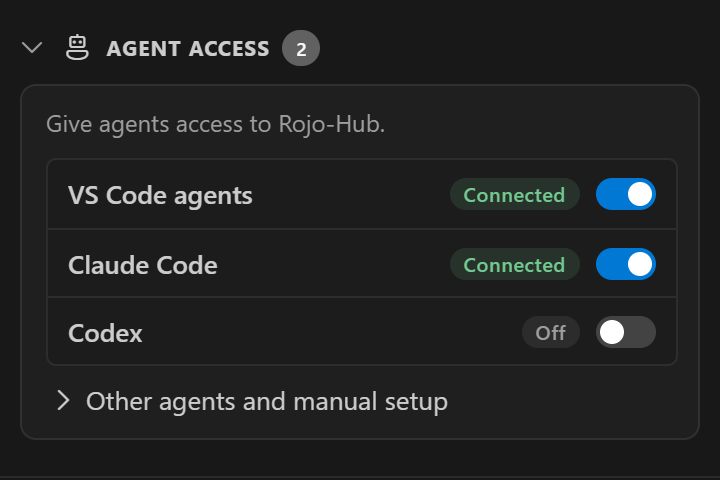
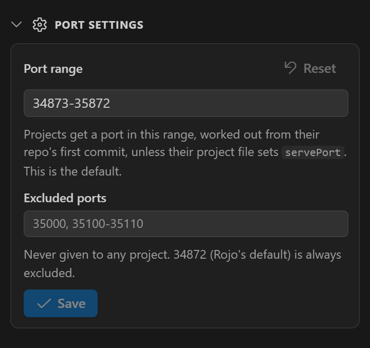

# How Rojo-Hub works

The complete description of Rojo-Hub as built: every feature, command, setting and file, what happens
underneath, and the known limits. It is the source for user documentation. Version 0.21.0,
2026-10-04. Why each design choice was made, with measurements:
[`specs/001-rojo-hub-foundation.md`](../specs/001-rojo-hub-foundation.md).

## Contents

1. [What it does](#1-what-it-does)
2. [Concepts](#2-concepts)
3. [Install, update, uninstall](#3-install-update-uninstall)
4. [Where to find it in VS Code](#4-where-to-find-it-in-vs-code)
5. [Projects](#5-projects)
6. [Ports](#6-ports)
7. [Connecting Studio](#7-connecting-studio)
8. [Switching branches](#8-switching-branches)
9. [Groups](#9-groups)
10. [Agents](#10-agents)
11. [The background service](#11-the-background-service)
12. [Files on disk](#12-files-on-disk)
13. [Settings](#13-settings)
14. [Commands](#14-commands)
15. [Known limits and troubleshooting](#15-known-limits-and-troubleshooting)
16. [For developers](#16-for-developers)

---

## 1. What it does

A VS Code extension for Roblox developers who use Rojo on several projects, or several branches of
one project, at once.

- **Each project gets its own Rojo port**; many serve at once.
- **Studio connects by itself.** Rojo-Hub's own Studio plugin syncs each place with its project
  (from `servePlaceIds`, or as assigned in the panel) and reconnects after any Rojo restart
  ([Connecting Studio](#7-connecting-studio)).
- **Any serving project switches to another branch or worktree** while Studio stays connected: it
  gets the difference as one update.
- **Groups** start, stop or take over a set of projects, like a profile.
- **AI agents serve their own worktree to Studio** through an MCP server, taking turns in one repo
  ([Agents](#10-agents)).

Works with Orca worktrees (shown under Orca's names) and plain git branches and worktrees.

## 2. Concepts

| Term | Meaning |
|---|---|
| **Project** (in code: *slot*) | One registered Rojo project: a git repo and one `*.project.json` directly in it, normally `default.project.json` ([Project files](#project-files)). Identified by that file's `name`. |
| **Port** | The TCP port its Rojo listens on, `localhost:<port>`. Fixed per project ([Ports](#6-ports)). |
| **Target** | What it serves: a **worktree** (in place) or a **branch** with no worktree (from a *view*). |
| **Primary checkout** | The repo's main folder, that other worktrees belong to. Registration always stores this. |
| **View** | A detached git worktree of a branch's commit that Rojo-Hub makes to serve a branch nobody has checked out, under `%LOCALAPPDATA%\RojoHub\views\`. |
| **Group** | A named set of projects started and stopped together. |
| **Service** | A background program that owns projects and their Rojo processes, separate from VS Code windows. |
| **Session** | One run of `rojo serve`. The Studio plugin stays connected only while the session is the same; restarting Rojo starts a new one. |

## 3. Install, update, uninstall

Distributed as a `.vsix` on [GitHub Releases](https://github.com/greenviper126/RojoHub/releases); a
Marketplace release is planned.

**Install**: Extensions view → `…` → **Install from VSIX…**, or
`code --install-extension rojo-hub-<version>.vsix --force`. That installs into the Default profile
only; each profile has its own extension list, so add `--profile "<profile name>"` for every profile
you open Roblox projects in. **Build it yourself**: `npm install`, then `npm run package`. Then
**reload the window**: a window open during the install does not load the new version until it
reloads.

In a remote window (WSL, SSH, Dev Containers) Rojo-Hub runs on the local Windows side, where Rokit,
Rojo and Studio are. It does not run in Restricted Mode: it runs git and Rojo in your folders, so the
workspace must be trusted.

**Update**: install the newer `.vsix` and reload **every** window with Rojo-Hub (each runs its own
copy). A window only ever replaces the service with a newer one. The new extension asks the older
service to exit and starts its own; Rojo keeps running, Studio stays connected, and the new service
adopts the Rojo processes. A window still on the old version keeps using the newer service and says
so once per new version: *Rojo-Hub ‹new› is running, but this window has ‹old›*, with *Reload
Window*. If that window's profile still has the old version, reloading does not help: install the
update there too. The message is not repeated for the same version, so a profile kept on an older
version is not nagged.

**Requirements**:

- Windows 10 or 11. Elsewhere the panel says *Rojo-Hub supports Windows only for now* and starts
  nothing.
- VS Code 1.101+.
- git 2.31+ on `PATH`. A missing or older git is reported when adding a project (and in
  `service.log`), with where to get a newer one.
- Windows PowerShell (built in).
- Rojo installed by [Rokit](https://github.com/rojo-rbx/rokit). Each project's toolchain file picks
  its version ([Projects](#5-projects)); `aftman.toml` and `foreman.toml` pins are read, but a Rojo
  installed by Aftman or Foreman themselves is not found. `rokit install` in the project installs
  what those files pin.
- Rojo 7.7+ for everything to work as described. Rojo-Hub installs its own Studio plugin (Rojo
  7.7's); Rojo's own is not needed.
- Orca is optional.

**One Windows user at a time.** Port 34870 is shared by everyone signed in to the PC. If another
user's Rojo-Hub runs, the panel shows *Rojo-Hub could not start* with *Port 34870 is used by another
Windows user's Rojo-Hub (‹their folder›). Only one signed-in user can run Rojo-Hub at a time.*
Rojo-Hub never uses or stops that service; it works again once that user signs out.

**Uninstall** from every profile. On VS Code's next start, the uninstall step removes its Claude Code
and Codex entries (if ticked), then stops the service and every Rojo it serves (only your own).
Delete `%LOCALAPPDATA%\RojoHub\` to remove state and views.

## 4. Where to find it in VS Code

### The Rojo-Hub panel

An activity bar icon (a hub: one dot joined to four) opens the panel in the sidebar. It opens by
itself the first time Rojo-Hub runs in a profile. It is drawn in VS Code's theme colours and icons,
does everything, and never pops menus at the top of the window.

**Live and immediate.** After loading, the panel follows the service as a stream: changes from
anywhere (another window, an agent, a crash restart, Studio connecting, a branch made in a terminal)
show within a fraction of a second, with no Refresh. Every click draws its result at once: Start
turns the card to *Starting…* (with Stop ready, to cancel), Stop to *Stopping…*; a picked branch or
project file shows straight away; group actions, Stop all, renames, deletes, member changes, new
groups, reordering and adding a project (an *Adding…* row) draw before the service answers. If the
service then disagrees (the action failed), the card shows what really happened and the error shows
as a notification. The branch picker, project file list and *Add a project* list are filled ahead of
time and kept current by the service, so they open already drawn. Menus, pickers, rename boxes and
confirmations stay open through updates unless their subject is gone. If the stream drops (service
restarting or updating), the panel polls every two seconds until it is back.

| The panel (sample data) | Switching branch inside a card |
|---|---|
|  |  |

**Sections** (fold open and closed) and a footer: Projects, Groups and Studio places start open;
Port settings and Agent access start folded. Within Projects only the first item starts open (the
first workspace, or with none, the first card). Folding is remembered. Opening a project from
elsewhere (a group, the status bar) unfolds its card and workspace. Section headers stick to the top
while scrolling; the footer sticks to the bottom.

**Collapse All** (title bar, as in the Explorer) folds everything except what is running: Projects
and Groups stay open, and so do cards of serving or starting projects, their workspaces, and running
groups. Everything else folds, Port settings included; Agent access is left as it was.

**Right-click on a foldable header** (section, workspace, card, group) replaces Cut/Copy/Paste with:

| Item | Does |
|---|---|
| **Expand** | Opens just that (folded) header. |
| **Expand All** | Opens it and everything in it (Projects: every workspace and card; Groups: every group; a workspace: its cards). Only on headers holding other foldable headers. |
| **Collapse** | Folds it (open header). |
| **Collapse Others** | Folds its neighbours in the same list (sections, workspaces, cards in one workspace, or groups) and opens it. |

Elsewhere right-click shows Copy. Workspace headers have no menu while the Projects filter is open.

**Narrow sidebars** (widths are rough; the panel measures its own content):

| Below | Changes |
|---|---|
| ~320px | A group's *Running* pill and Agent access's status chips hide. |
| ~280px | Counts lose their words ("2/5"), footer reads "3/5"; Studio places' hand-connect ports lose project names; the project file row shows just `default`/`test` without its label; card Stop/Start and *Copy commands*/*Copy prompt* become icons; window badges, a folded card's error/warning icon (the card stays tinted), *not added* and *shown above* hide; a group's rename and delete show only on hover. |
| ~270px | The status pill shrinks to its icon, and a workspace's *Group* button too. |
| ~230px | Ports leave project headers and group members (*Copy Port* still works); footer Refresh hides and Stop all becomes an icon. |
| 170px | The panel stops shrinking and scrolls sideways. |

**Your own order.** Cards, workspace blocks and group cards have a grip (⋮⋮) in their left margin on
hover; drag onto another to move before or after it (cards within their workspace, workspaces among
workspaces, groups among groups). The order is saved in the service, so every window shows it. It
**never changes a port**: port collisions go by the order projects were added.

**Projects** (header: serving count, filter icon, `+`). Each card has:

- grip, fold arrow, **status light**, **name** (a window icon marks this window's project). Folded,
  a project serving a file other than `default.project.json` shows a small tag (`test` for
  `test.project.json`);
- the **port** (`:35045`) top right; click copies `35045` (copy icon on hover, green tick after);
- **what it serves** (folder icon: worktree; branch icon: branch). Click opens the branch picker in
  the card: a search box, then *Worktrees* (Orca's names), *Local branches* and *Remote branches*
  (cloud icon; only those with no local branch of that name), each with a count. Branches show when
  they last had a commit; the current one is ticked. Click switches; Enter picks the first match;
  Escape closes. Studio stays connected. **Fetch** (⟳) and **New branch** are in
  [Switching branches](#8-switching-branches);
- **the project file** (`default.project.json`, …) on its own row, since it decides what Studio gets.
  Click opens a list in the card ([Project files](#project-files)). Narrow: just `default`/`test`;
- the **agent claim** while held: *Agent in ‹worktree› until 14:05* ([Agents](#10-agents));
- **warnings** (yellow) and **errors** (red), in full. A Rojo error shows its first line, then up to
  the last five lines Rojo logged about it, with *Show full log*;
- while `rojoHub.openPlaces` is on, its **places** (`servePlaceIds`, then `placeId`, not
  `blockedPlaceIds`), whether each is open in Studio, and **Open**, or **Reopen** and **Close**
  ([Opening places](#opening-places-in-studio));
- a bottom row: **status pill** (*Connected*, or *Connected · 2* with two Studios; *Serving*
  (waiting for Studio); *Starting…*; *Stopping…*; *Stopped*; *Error*; *Unavailable* (service not
  running)), a **⋯** menu, and **Start** or **Stop** (a project in error has both). The ⋯ menu,
  opening up or down as room allows: *Update sourcemap.json* with its status (worktree targets;
  [Sourcemaps](#sourcemaps)), *Open all places in Studio* (with `openPlaces` on and a place not
  open), *Build place file…*, *Show Rojo log*, *Remove from Rojo-Hub…* (asks first).

A folded card is one row: grip, arrow, light, name, a warning/error icon, a robot icon while an
agent holds a claim, the port, and Start or Stop (both in error). A left rail shows state: green
serving, blue starting, red error (an erroring card is also tinted red). With no projects, the
section explains Rojo-Hub and offers *Add a project* and the *Getting started guide*.

**Build place file…** runs the project's pinned `rojo build` on exactly what it serves, so a
branch's borrowed project file and packages match Studio. A save dialog opens on
`<project>-<branch>.rbxl` in the last folder built into, or Documents the first time (never inside
the repo, where it would be untracked); characters Windows forbids become `-`. A spinner shows while
it builds; then a message gives the size and offers *Reveal in File Explorer*.

**Filter** (Projects header) opens a box above the cards: projects whose name, branch or port match
every word stay; workspaces with no match hide, the rest open. Escape or ✕ clears. Not remembered.

**Grouped by workspace.** Projects in a `.code-workspace` are listed under its name, with its
serving count, a window icon for this window's workspace, and a **Group** button making a group of
its projects. Listed folders with a `*.project.json` not yet added show as *not added* with **Add**
(and *Add all* for several). Others are under **Other projects**. See [Workspaces](#workspaces).

**Add a project** (`+`) lists this window's folders and the repos Orca knows, each with `+`, and
*Browse…*. The new card is highlighted once added.

**Groups** (header: count; `+` makes one). *New group* opens a name box; Enter or *Create*. Each
group card folds and shows how many of its projects serve (green when all). Inside:

- its nested groups, then its projects, each project with its port (click copies) and ✕ to take it
  out (asks *Take … out of …?*); a name click jumps to its card;
- an **Add a project, group or workspace…** dropdown: workspaces (adds each of their projects),
  projects not in it, then groups (those that would loop greyed out);
- one **Start** / **Stop** button bottom right (Stop keeps projects another running group uses); a
  folded group shows ▶ / ■ in its header;
- a green *Running* pill (hidden when narrow) and green rail while running;
- ✎ rename in place (Enter saves, Escape cancels) and 🗑 delete (asks *Delete …?* under the name;
  projects stay), shown on hover.

**Studio places** (below Groups; header: count): every open place with Rojo-Hub's plugin, its name
(and *unsaved*), what it syncs with or waits for, a status pill (*Synced*, *Connecting*, *Waiting*,
*Assign a project*, *Rojo too old*, *Reopen the place*), and a list to assign a project; *Automatic*
follows project files and the last sync ([Connecting Studio](#7-connecting-studio)). A place that
does not connect by itself (*Assign a project*) also gets *or connect by hand:* with every serving
project's port to copy. With no place open it says so and how many projects serve. (0.19.3 removed
the *Active ports* section this replaced.)

**Agent access** (below Port settings, folded; header: how many agents can use Rojo-Hub): a switch
per agent with a chip (*Connected*, *Off*, *Not installed*, *Set up by you*, *Can't read config*),
and a folded *Other agents and manual setup* part with the server's address and buttons to copy setup
commands or a prompt. See [Agents](#10-agents).

**Agent notice** (above Projects): *Let Claude Code … use Studio*, with *Set up* (opens and scrolls
to Agent access), *Later* and ✕. Shown only while a project is registered, Claude Code or Codex is
installed, and neither has any `rojohub` entry: it hides once one is *Connected* or *Set up by you*,
and while a config *Can't be read*. *Later* hides it 14 days, ✕ for good; every window and profile
agrees (`agent-notice.json`).

**Port settings** (folded): port range and excluded ports as text boxes, with *Save* and *Undo*;
mistakes are shown before saving. The range has **Reset** to the default (34873–35872), which asks
first and says how many projects get their port from the range (their ports may change and serving
ones restart); greyed out when already default. Excluded ports have no reset. These edit the user
settings in [Settings](#13-settings).

**Footer**: serving count, **Stop all**, Refresh. *Stop all* stops every serving, starting or
erroring project and marks every group not running, after asking in the panel with what it will
stop. The service never appears; Rojo-Hub starts it when needed.

While an action runs, VS Code's progress bar shows on the panel and the button that started it is
disabled.

### Other ways in

- **Rojo-Hub: Open Menu** (command palette; list icon in the title bar): the same actions as quick
  picks, like *Rojo: Open Menu*. Lists projects, groups, then *Add Project*, *New Group*, *Port
  Settings* (VS Code's Settings filtered to Rojo-Hub), *Agent Access* (Settings on `rojoHub.agents`)
  and *Stop All*.
- **Status bar**: in a window on a registered project, `Rojo :<port> · <what it serves>` with its
  state icon. Click opens the panel and highlights that card.
- **Get Started walkthrough**: Welcome page (Help → Welcome, *Get Started with Rojo-Hub*), or
  *Getting started guide* in the empty panel. Five steps: add, start, connect Studio, switch, group.

**Status lights**

| Light | Meaning |
|---|---|
| grey ring | stopped |
| spinner | starting |
| green ring | serving, no Studio plugin connected |
| green dot | serving, at least one Studio plugin connected |
| red dot | error (the card shows it; the log has the rest) |
| dashed grey ring | unavailable: the service could not be started |

## 5. Projects

**Add a project** (`+`) lists this window's folders and Orca's repos, plus *Browse…*. Any folder in
a repo works; the primary checkout is registered. It fails when:

- the primary checkout has no `*.project.json` directly in it, or the chosen one has no `name`;
- the repo is already registered **with the same project file** (*‹folder› is already registered*).
  One repo can be registered with different `*.project.json` files if their `name`s differ;
- another project uses the same `name` (a place remembers its last project by name, in Rojo-Hub's
  record and the plugin's);
- no port can be given: its `servePort` is 34870 or another project's `servePort`, or the range is
  full ([Ports](#6-ports));
- git is missing or older than 2.31.

A new project points at its primary checkout and is stopped.

### Project files

A project serves one `*.project.json` directly in its folder. On adding: `default.project.json` if
present (no question); else the only `*.project.json` (a library with just `test.project.json`, say);
else a list to choose from.

The **project file row** opens a list in the card of the folder's `*.project.json` files, current one
ticked; click switches, Escape closes. The service sends each project's list with every status update
(re-reading the folder at most every two seconds), so it opens at once and added or deleted files
appear by themselves, even while open. **Browse…** at the bottom opens a file dialog in the project's
folder; only a `*.project.json` directly in it is taken. *Project File…* in the project's menu offers
the same as a quick pick. The choice is saved with the project across restarts and updates. That is
how a library is served with its tests: pick `test.project.json`.

- Changed only while **stopped** (or in error, e.g. a branch without the file). While running or
  starting, the row is greyed with a lock. Rojo reads the name, `servePort` and place IDs once per
  session, so a new file means a new session.
- The project takes the new file's `name`, which must be unique. A file another project of the same
  repo serves is refused (*Another project already serves ‹file› from ‹folder›*).
- The port stays unless the new (or old) file sets `servePort`.
- Everything follows the file: what Rojo serves on every branch, `sourcemap.json`, *Build place
  file…*. A tree without that file shows an error until you switch back or pick another file.

**The project's menu**: Switch Branch…, Start or Stop Serving (both in error), Copy Port (the number),
Project File… (locked, with the file's name, while running or starting), Show Rojo Log, Remove
Project, All Projects (back to Open Menu). *Show Rojo Log* before any start says *‹project› has no
Rojo log yet; it appears once the project has been started.* The first line of its error, else its
first warning, shows at the top (the card shows them all).

**Start Serving** runs `rojo serve` in the primary checkout's folder with the pinned Rojo, and waits
until Rojo answers with the project's name, or reports the end of the Rojo log after 30 seconds.

**Which Rojo.** The toolchain file is read as Rokit does, always from the **primary checkout** (not
the served tree): `rokit.toml`, `aftman.toml` or `foreman.toml` in the project folder, then each
folder above, then `~/.rokit/rokit.toml`; the nearest that pins Rojo wins, `rokit.toml` first within
a folder. That version runs straight from Rokit's tool storage
(`~/.rokit/tool-storage/rojo-rbx/rojo/<version>/rojo.exe`) with no console, so **no window opens**.
(Rokit's `rojo` shim starts Rojo as a console program, which made Windows flash a Terminal window.)

- Pinned version not installed: *Rojo 7.3.0 (pinned in …\MyLibrary\aftman.toml) is not installed. Run
  "rokit install" in …\MyLibrary, or pin a Rojo version you have.*
- Nothing pins Rojo: starting says so and suggests `rokit add rojo-rbx/rojo`.
- Rojo older than 7.7 starts with a warning. **Rojo 7.7 is the first with protocol 5, and the plugin
  connects only to the same protocol**, so the 7.7 plugin refuses Rojo 7.0–7.6 (protocol 4: *"it's
  using a different protocol version, and is incompatible"*). Rojo-Hub's plugin does not connect such
  a project by itself; its Studio places row says *Rojo too old*. Keep every project on 7.7. Live
  switching itself was measured working on 7.3.0; the Studio-connected light needs 7.7. Older Rojo
  answers the status check in JSON rather than MessagePack; both are read.

**Stop Serving** stops only that project's Rojo; other projects and hand-started Rojo are untouched.

**Remove Project** stops its Rojo, deletes its generated files and views, and removes it from every
group. Project files are never touched. If that frees a port another project was pushed off
([Ports](#6-ports)), that project moves back a few seconds later; the confirmation names each project
that will move, from and to which port, and says when it is serving and Studio must reconnect.

### Workspaces

A `.code-workspace` file lists folders that open together (`MyGame.code-workspace` listing MyGame,
MyGameServer, SharedLib). Rojo-Hub uses them only to arrange the Projects list.

- **Where it looks**: this window's workspace file and the top folder of every added project.
  Comments and trailing commas are fine; remote (`uri`) folders are ignored.
- **Which projects**: listed folders are matched to added projects by primary checkout, so a
  worktree folder counts as its project.
- **Drawn once**: a project in two workspaces is drawn under the first (this window's, then by name);
  the other shows a *shown above* row that jumps to it.
- **Adding and removing** stay per project: *Add* / *Add all* adds folders as ordinary projects.
- **Group** makes a group named after the workspace (or *Name 2*, … if taken) of its added projects;
  an ordinary group from then on, unaffected by later workspace changes.
- Workspace files are re-read when projects are added or removed, the window's workspace changes, and
  on Refresh.

## 6. Ports

Decided by these rules, in order, rechecked every 3 seconds and whenever the project list is read:

1. **`servePort`** in the project file, when set. Rojo's own field: committed, so every clone agrees,
   and plain `rojo serve` uses it too. It wins over settings: a `servePort` in
   `rojoHub.excludedPorts`, or 34872, is still used, with the note *servePort ‹p› is in
   rojoHub.excludedPorts; the project file wins.* Exceptions:
   - not a port (not a whole number 1–65535): *servePort ‹value› is not a port; use a whole number
     from 1 to 65535.*
   - **34870** (the service's port): error *servePort 34870 is Rojo-Hub's own service port. Pick
     another port in the project file.*; the project cannot start.
   - **two projects with the same `servePort`**: the first registered keeps it; the other errors
     *servePort ‹p› is also set by ‹name›; two projects cannot share a port. Change one of them.* and
     cannot start.

   Adding a project whose `servePort` is refused fails with that message.
2. **Otherwise a hash of the repo's oldest root commit**, placed in the range (default
   `34873-35872`). Every clone shares it and renames do not change it, so it is the same on every
   machine and reinstall.
3. **Collisions**: a hashed port that is excluded, claimed by a `servePort`, or taken by an
   earlier-registered project moves to the next free port, wrapping around. The moved project shows
   *Its own port ‹p› is taken by ‹name› (or: is excluded), so it moved to ‹q›. Set "servePort" in its
   project file to fix a port.* A `servePort` always beats a hashed port. A full range shows *No free
   port left in ‹first›-‹last›.*
4. **Hashing never picks 34872 (Rojo's default, for plain `rojo serve` and tools expecting it) or
   34870**, whatever the settings say (a `servePort` of 34872 is still honoured). A range may be one
   port (`35000-35000`).

**A project file that briefly fails to parse** (auto-saved half-typed JSON, a locked file) keeps the
last `servePort` read, so the port does not bounce.

**Excluding ports** for all projects: `rojoHub.excludedPorts` ([Settings](#13-settings)).

**When a port changes** (a `servePort` added, changed or removed; the port excluded or range changed;
the project that pushed it off removed), a serving project restarts on the new port: a new session,
and Rojo-Hub's plugin moves to it by itself. The card shows *Port moved from A to B. Places with
Rojo-Hub's Studio plugin carry on by themselves, without showing a disconnect; with Rojo's own plugin, reconnect Studio.* (stopped:
just *Port moved from A to B.*), and VS Code warns *Rojo-Hub: ‹project› moved from port A to B. …*
with **Copy Port** and **Show Project**, in the window with the project open, else the focused one.
Rojo's own plugin remembers the last port per place, so set the new one once there.

**A move waits until the new port has held.** Moves from a project file or a removal happen once the
new assignment has been stable 2.5 seconds (a few seconds in practice, with the 3-second recheck), so
typing a `servePort` with auto-save (3, 34, 349…) or deleting and restoring a line does not restart
Rojo each step. Port settings changes (`rojoHub.portRange`, `rojoHub.excludedPorts`) move at once, as
does changing a stopped project's project file.

**If another program holds a project's port**, starting fails saying so; exclude that port and the
project moves.

## 7. Connecting Studio

Rojo-Hub installs its own Studio plugin (spec 007): Rojo 7.7.1's, changed to connect by itself, with
no port typed and no click.

**Which project a place syncs with** is decided in VS Code. When a place opens, the plugin sends its
`PlaceId` and the service answers, in order:

1. the project assigned in the panel's **Studio places**;
2. a project whose `servePlaceIds` lists it;
3. a project whose `placeId` is it;
4. the project it last synced with, unless `rojoHub.studioAutoConnect` is `"listed"` (then only
   listed or assigned places connect by themselves; others by hand each time). The service records
   this (`placeSynced` in `registry.json`) whenever a place syncs; the plugin's own per-place record,
   like Rojo's, is only a fallback, since every open Studio shares and overwrites that one setting.

`blockedPlaceIds` never matches. Only a **serving** project is connected to; if the first step that
finds a project finds only stopped ones, the plugin says which to start rather than falling through.
One project may serve several places; each syncs on its own.

**Both directions.** The plugin keeps a WebSocket to the service (`ws://127.0.0.1:34870/studio`), so
it connects when the place opens, when its project starts later, and again with no click when Rojo
restarts with a new session (crash, port move, project file change). A branch switch keeps the
session, so nothing happens.

**Restarts you do not see** (spec 010). When the session a place is synced to ends and the user did
not end it, the plugin holds the loss: Rojo's window stays on *Connected*, no notification or sound
is shown, and the new session is connected to as soon as the service names one, applying only what
changed (no confirmation, for a place that synced with the project before). The service says when
it is restarting a project itself (a crash, a port move), and the hold lasts until it is back, up to
a minute; otherwise (someone pressed stop, then start) it lasts five seconds. Only if no new session
of the same project comes is the disconnect shown, as Rojo would have shown it. **Disconnect** during
a hold ends it, and nothing connects by itself for a minute.

**Changes Studio could not apply.** When a switch adds a node Studio cannot create but already has
(`StarterCharacterScripts`, `StarterPlayerScripts`, a service), the plugin uses the existing one, as
a first sync does, and syncs everything under it; under such a node, an existing child of the same
name and class is used rather than duplicated. Anything else a patch leaves unapplied (Rojo shows it
under *View changes*) is reported to the service, and agents' `serve_here` and `switch` say what
it was.

**Studio places** lists every open place with the plugin, what it syncs with or waits for, and a list
to assign it a project. *Automatic* (default) follows the order above; picking a project syncs at
once. Assignments are kept per place ID (`placeChoices` in `registry.json`; removing the project
forgets them). An unsaved place (`PlaceId` 0, or a template's ID such as a new Baseplate's) shares
its ID with other unsaved places, so its assignment lasts only while that Studio window is open.
Studio's Rojo window only shows the service's answer, in a line under its buttons.

**Connect to `<project>`.** While the place's project serves, a green button under Rojo's Connect
names it. It connects to Rojo-Hub's port for it whatever the address boxes say, and works after
**Disconnect** or **Abort** and with *Rojo-Hub Auto Connect* off. Rojo-Hub never writes the address
boxes; they keep what you last typed.

**When it does not connect by itself**, the Studio places row and Studio's line say why:

- the place is not saved to Roblox: assign it a project;
- no project lists it and it never synced: assign one;
- two serving projects claim it: assign one (a place keeps to the project it last synced with, so
  this only asks for a place that synced with neither);
- its project runs Rojo older than 7.7 (the plugin speaks only protocol 5): pin
  `rojo-rbx/rojo@7.7.0`;
- you pressed **Disconnect**, or **Abort** on the first sync: that session is not reconnected by
  itself. *Connect to `<project>`*, connecting by hand, assigning in VS Code, or a new session lifts
  it;
- *Rojo-Hub Auto Connect* is off in the plugin's settings.

Rojo's confirmation (Accept/Abort with the diff) is asked **once per place and project**, listed or
not, since that first sync can overwrite the place. Once accepted, Rojo-Hub remembers the pair
(`placeAccepted` in `registry.json`, shared by every Studio) and the plugin accepts later syncs by
itself (reopening, Rojo restarts, crashes). Abort declines that session and remembers nothing.
*Confirmation Behavior* keeps Rojo's meaning on top: *Always* asks every time, *Never* never.
Removing a project forgets its pairs. While a confirmation is open, Studio places and agents'
`status` say it waits for you. A place that last synced with a project waits for it while its Rojo
restarts; it is never handed to another project claiming it. Nothing connects during a playtest.
Without the service running, the plugin behaves like Rojo's own, Auto Reconnect included.

**Install.** The service copies `RojoHub.rbxm` (built from `plugin/` into `dist/`, see [For developers](#16-for-developers)) into
`%LOCALAPPDATA%\Roblox\Plugins` on start and update, only when it differs. Studio loads a new or
changed plugin only when a place opens, so an update reaches each open place when it is reopened.
Other `RojoHub*.rbxm`/`.rbxmx` files there (e.g. a copy from a GitHub release) are removed. Rojo's own
`RojoManagedPlugin.rbxm` is left alone; the panel suggests removing it, since Studio would show two
Rojo windows. `rojoHub.studioPlugin: false` stops all this. Uninstalling removes `RojoHub.rbxm`
(unless that setting was off).

**Connecting by hand** works as with Rojo's plugin: `localhost` and the project's port (*Copy Port*),
then Connect. Project names must be unique and must not change across branches, since a place
remembers its project by name.

With `servePlaceIds` set, Rojo itself refuses unlisted places. Rojo-Hub passes `servePlaceIds`,
`blockedPlaceIds`, `placeId`, `gameId` and `emitLegacyScripts` through from the primary checkout's
project file.

**How it knows Studio is connected**: Rojo's log records each plugin connection opening and closing;
Rojo-Hub counts them for the filled/outlined icon and tooltip. Rojo-Hub's plugin also reports which
place it is, so the *Connected* pill's tooltip names them.

### Opening places in Studio

Off by default: turn on `rojoHub.openPlaces` (spec 009). Then each card lists its places and agents
get `open_place`. Off, the card shows none of it and the API and `open_place` say the setting is off.

- **Open** opens the place for editing, like the website's *Edit in Studio* (a `roblox-studio:` link
  with the universe ID). The plugin connects it as usual. *Open all places in Studio* (⋯ menu) opens
  every one not open.
- **An open place is never opened again** (Studio would open a second copy). A place counts as open
  when its plugin reports it, or a running Studio's command line names it (covering the seconds before
  the plugin connects). Two simultaneous opens open it once. A place opened another way (Studio's
  start page) with its plugin off is not seen.
- **The universe ID** is the project file's `gameId`, else looked up once from Roblox
  (`apis.roblox.com`, no sign-in) and kept in `universes.json` with the place's name. A failed lookup
  (no internet) says which place and why; try again.
- **Close** asks the place's Studio window to close, as its ✕ does, so Studio still asks about
  unsaved changes. Rojo-Hub never kills Studio. It can tell a place's window only when Studio was
  started with the place's link (by Rojo-Hub or the website); otherwise the card says to close it in
  Studio.
- **Reopen** closes it, waits (up to 5 minutes, while you answer Studio's prompt) for that Studio to
  exit, then opens it: how an open place picks up a new plugin.

Agents can open a place (`open_place`), never close or reopen one: that window may be yours.

## 8. Switching branches

**Switch Branch…** lists:

- **Worktrees**: every git worktree (primary first, then by latest commit), under Orca's names when
  Orca is installed. Served **in place**: edits there, yours or an agent's, reach Studio live.
- **Branches**: local branches not checked out in a worktree, and remote branches with no local
  counterpart. Served from a **view** (below). The panel lists local and remote separately, as in
  Source Control.

**Kept current in the background.** The service caches each repo's list and watches its `.git`
folder: a new or deleted branch, a fetch, a new worktree or a checkout anywhere (terminal, Source
Control, Orca) updates it within about a second. Orca's names are re-read when the list is over a
minute old. The picker opens drawn, and a newer list updates in place, keeping what you typed.

**Fetch** (⟳ in the search box) runs `git fetch --all --prune`. It never asks for a password (git's
prompt and Git Credential Manager's window are both off); a failure (offline, no access) shows in the
picker. Rojo-Hub never fetches by itself.

**New branch.** The picker's last row is *New branch…*, or *New branch "‹typed›"* when the search
text is not an existing branch. Its form has the name and **From** (current target, then local, then
remote branches). *Create* makes the branch in its own folder and switches to it, Studio connected:

- repo in **Orca**: an Orca worktree (`orca worktree create`, setup skipped); Orca names the branch
  `<your git user>/<name>`;
- otherwise: a git worktree in `<repo>-worktrees/<name>` beside the repo.

An invalid name, an existing branch or a missing base is pointed out before anything is made. Done,
a message offers *Open in New Window*.

### Sourcemaps

While a project serves a worktree, Rojo-Hub keeps its `sourcemap.json` current with the pinned
`rojo sourcemap --watch`, for luau-lsp and tools like `wally-package-types`, whether or not VS Code,
a window on that folder, or luau-lsp is open (so a windowless Orca agent gets it too).

- **Same file as luau-lsp**: the same command (`sourcemap <project file> --include-non-scripts`, from
  the worktree), so both can run.
- **Recovers**: a deleted folder crashes Rojo 7.7's watcher (same bug as below); it restarts a second
  later, giving up with a note after five crashes in a minute. Studio is unaffected.
- **Never adds a file to git**: writes only where `sourcemap.json` is gitignored or exists. Otherwise
  the ⋯ menu says so, and *Update sourcemap.json* writes it once.
- **Not for views**: nothing edits those.
- Stops with the project, moves with a switch. `rojoHub.sourcemaps` turns it off.

**Checking out in a served worktree.** The picker never touches your folders. A checkout *inside* a
served worktree (terminal, Source Control, Orca) sends Studio that branch, and the card says *‹branch›
was checked out in ‹folder› while it was being served*. If it removed a folder, Rojo 7.7 crashes
([Known limits](#15-known-limits-and-troubleshooting)); Rojo-Hub restarts it on the same port and the
card says the checkout caused it and Studio needs reconnecting.

### What happens on a switch

Rojo is never restarted to switch. Each project is served from a generated `slot.project.json` whose
only meaningful content is one pointer to the served tree's own project file. A switch rewrites it;
the running Rojo re-reads the project from the new tree and sends Studio the difference as one update
in the same session. Studio stays connected and is not asked to confirm (only the initial sync is).
The card shows the new branch at once, whoever switched.

Rojo reads the served tree's **own** project file, so its mappings, `globIgnorePaths` and `syncRules`
apply, and edits to it sync live. The project's `name` and place-ID settings always come from the
primary checkout, since Rojo reads them only at session start.

### Packages (Wally)

A worktree that has not run Wally lacks `Packages`/`ServerPackages`. Rojo-Hub then serves it
**borrowed**: a generated copy of its project file (`borrowed.project.json`) with every `$path` made
absolute, taking the missing folders from the primary checkout.

Borrowed mode is used whenever the served tree lacks a folder its project file maps (a relative
`$path`) and the primary has it. Only those folders are borrowed; one missing from both is left for
Rojo to report. Complete trees are served natively. So views (never Wally'd) usually borrow, but a
branch with committed packages, or no package folder, is native.

The card warns *Packages, ServerPackages come from the primary checkout (not present in this tree).*
If the branch changed `wally.toml` and a missing folder is a package folder (`Packages`,
`ServerPackages`, `DevPackages`), more strongly: *This branch changed wally.toml but has no ‹folders›
of its own; the primary's copies do not match it. Run Wally in the worktree before trusting what
Studio shows.* In borrowed mode `globIgnorePaths` and `syncRules` do not apply (the copy lives in
Rojo-Hub's folder, so relative rules match nothing), and the card says so when the file uses them.
Run Wally in the worktree to serve natively. Edits to the tree's project file are carried into the
copy while served.

### Views

A branch with no worktree gets a view: `git worktree add --detach` of its current commit into
`views\<project id>\<first 12 hex digits of the commit>\` (`-2`, `-3`, … if taken). A view of the same
commit is reused, and a view is never modified: new commits mean a new view on the next switch.
Views are deleted only while the project's Rojo is stopped (stop, start, remove, or a switch while
stopped), because of the Rojo crash in [Known limits](#15-known-limits-and-troubleshooting). They
never appear in the Worktrees list, even with `%LOCALAPPDATA%` behind a junction or redirected.
Making a view runs no git hooks (`post-checkout`, husky), and cleanup drops only git's record of
Rojo-Hub's own views, leaving your worktrees on unplugged drives alone.

## 9. Groups

A named set of **projects and other groups**, like a profile. A project or group can be in several.
Groups are in the panel's **Groups** section, below Projects.

### Making and filling groups

- **Make one**: `+` on Groups (or *New Group* in Open Menu); type a name, Enter or *Create*.
- **Add** with the card's **Add a project, group or workspace…** dropdown, one pick at a time:
  - **Workspaces**: adds every project of that workspace not yet in the group (e.g. all three of
    MyGame's), as ordinary members removable with ✕. Workspace folders not added to Rojo-Hub are
    skipped (the entry says when). A workspace fully in the group is greyed out.
  - **Projects** not in the group yet.
  - **Groups**, with looping ones greyed out.
- **Take out** with ✕; it asks in place (*Take SharedLib out of My Game? Yes / No*). Nothing is
  deleted.
- **Nested groups** are listed first, with a layers icon and their serving count; click scrolls to
  their card.

### Loops

A group can't contain itself, directly or through others. Adding B to A is refused when B contains A
anywhere: greyed out in the dropdown as *(would loop: it contains A)*, and refused by the service with
the chain (*Outer → Middle → Inner*). A loop in `registry.json` from elsewhere is still expanded once
per group, so nothing hangs. Deleting a group removes it from every group holding it.

### Running groups

A group holds every project inside it, through nested groups; its count (`2/3`) is over all of them.

| Action | Effect |
|---|---|
| **Start** / **Stop** | One button: Start while not running, Stop while running. |
| **Start** | Serves every project it holds, each on its own port. Already-serving projects are left alone, so their Studio sessions continue. |
| **Stop** | Stops its projects **except any another running group holds**; Rojo-Hub says which it kept and why. |
| ✎ **Rename** | In place; Enter saves, Escape cancels. |
| 🗑 **Delete** | Asks *Delete?* in place. Deletes the group only. |

A group is **running** from Start until Stop (green *running* badge and edge). Running is about what
you started, not whether its projects happen to serve, so a group never started keeps nothing alive.
Stopping one project from its card does not change which groups run. (0.19.5 removed *Singleton*,
which also stopped everything outside the group; agents' `start_group` keeps it as `only`.)

If some projects fail to start or stop, the rest proceed and one message lists the failures. Groups
remember members, not branches. Removing a project removes it from every group. Group names are
unique, ignoring case.

## 10. Agents

AI agents (Claude Code in a terminal or Orca worktree, Codex, Copilot and other VS Code agents) use
Rojo-Hub themselves: serve their own worktree to Studio, start, stop and add projects, run groups,
make branches in their own worktrees, read Rojo's log and wait for Studio to sync. They get this from
an MCP server the service runs at `http://127.0.0.1:34870/mcp`; no extra files, scripts or
instructions, since the server describes itself when the agent connects.

**Turning it on**: a switch per agent in the panel's **Agent access**, or a checkbox per agent in
`rojoHub.agents` (the same setting).

| Agent | Default | Turning it on |
|---|---|---|
| VS Code agents | on | Registers the server with VS Code; nothing written to disk. |
| Claude Code | off | `claude mcp add --scope user --transport http rojohub http://127.0.0.1:34870/mcp` |
| Codex | off | `codex mcp add rojohub --url http://127.0.0.1:34870/mcp` |

Turning off runs the matching `mcp remove`. Switches reflect each agent's own config, so a
hand-removed entry shows off:

- Claude Code: top-level `mcpServers` of `$CLAUDE_CONFIG_DIR/.claude.json` when `CLAUDE_CONFIG_DIR`
  is set **and that file exists**, else `~/.claude.json`;
- Codex: `mcp_servers` of `config.toml` in `CODEX_HOME` if set, else `~/.codex/config.toml`.

| Chip | Meaning |
|---|---|
| *Connected* | The config has Rojo-Hub's `rojohub` entry. |
| *Off* | Installed, no `rojohub` entry. |
| *Not installed* | Its CLI (`claude`, `codex`) is not on `PATH`; switch greyed out. |
| *Set up by you* | A `rojohub` entry with another URL. Never changed or removed; switch greyed out. |
| *Can't read config* | The file exists but cannot be read or parsed (maybe mid-write). Left alone and rechecked; never taken for "no entry", so nothing is added, removed or switched off because of it. Switch greyed out. |

While a change applies the chip reads *Working…*; a failure shows under the row.

Rojo-Hub changes an agent's config only when you change its switch (or answer the first-run
question), never merely on startup. **When a window opens** and finds a switch on for an installed
agent with no `rojohub` entry, it treats the entry as removed by hand and turns the switch off,
instead of re-adding it. **`rojoHub.agents` is not synced by Settings Sync**: it describes this
machine's configs. The first time Claude Code or Codex is found installed with no entry and no choice
made, it asks once: *Let … use Rojo-Hub's tools?* Yes turns them on; No turns them off and hides the
agent notice for 14 days.

**Another agent?** Under *Other agents and manual setup*: *Copy commands* (**Rojo-Hub: Copy Agent
Setup Commands**) copies both commands and a JSON entry for JSON-configured agents; *Copy prompt*
(**Rojo-Hub: Copy Agent Setup Prompt**) copies a paragraph to paste into any agent, which then adds
Rojo-Hub to its own config.

**The tools.** Everything the panel does except your own setup; Rojo-Hub is mainly for several agents
at once, so an agent should not need to ask you to click.

| Tool | Does |
|---|---|
| `status` | Every project: port, serving or not, Studio places synced to it (name, place ID, why, plugin version), target and project file, claimant, warnings and `sourcemap.json` state, listed places and whether each is open; then groups and every open Studio place. Given the agent's folder, also whether its worktree is served. |
| `serve_here` | Switches the agent's repo's project to its worktree, live, and claims it; names the Studio places showing it and any Rojo error. `wait` takes it once another worktree's claim ends. |
| `switch` | Switches a project to a branch (its worktree if any, else a view) or worktree, and claims it. Takes `wait`. |
| `new_branch` | Makes a branch in its own worktree (through Orca when Orca manages the repo), switches to it and claims it; answers the folder to work in. |
| `branches` | Switch targets, newest first (`fetch` fetches first). |
| `release` | Drops the agent's claim; the project keeps serving. |
| `start` | Starts a stopped project. |
| `stop` | Stops a project. Guarded. |
| `stop_all` | Stops every project. Always needs `force`. |
| `add_project` | Registers a folder's repo (optionally another `project_file`). |
| `remove_project` | Unregisters a project; never deletes files. Guarded. |
| `project_files` | The folder's `*.project.json` files and which is served. |
| `set_project_file` | Serves another project file; only while stopped. |
| `start_group` / `stop_group` | Starts or stops a group (`only` also stops everything outside). Stopping is guarded. |
| `create_group` / `edit_group` / `delete_group` | Makes, renames, changes members of, or deletes a group. |
| `log` | The last lines of a project's Rojo log. |
| `wait_for_studio` | Waits until a Studio place syncs to the session, and names it. |
| `open_place` | Opens a project's place (`placeId`, optional when it has one) unless open, then does nothing and says so. Only with `rojoHub.openPlaces` on; agents cannot close places. |
| `build` | `rojo build` of what a project serves into a `.rbxl`/`.rbxlx` the agent names. |
| `sourcemap` | Writes the served worktree's `sourcemap.json` once. |

**Guarded.** `stop`, `stop_group`, `remove_project` and `start_group only` are refused while another
worktree holds the claim, or while a Studio place is synced and the agent holds no claim; the claim
holder may stop its own project. The refusal says who or what is affected. `force` overrides, and
agents are told to pass it only when you ask. Starting, adding and group edits disturb no one.
`set_project_file` works only on a stopped project. Which project a place syncs with, agent
registration and settings stay yours (spec 008).

**Rojo's errors come back.** After `serve_here`, `switch`, `new_branch` and `start`, the tool waits
about a second (a switch applies in that time) and adds any Rojo error and the card's warnings. `serve_here` and `switch` also add what each synced Studio place reported it could not apply since the call began (spec 010), and say not to stop and start the project for it; the tool descriptions and instructions tell agents that stopping a project disconnects Studio and a switch never needs it.

**Waiting instead of polling.** With `wait` (seconds, up to 600), `serve_here`, `switch` and
`new_branch` wait out another worktree's claim and take the project the moment it is released or
expires; waiters are served in the order they asked.

**Which Studio to look at.** `status`, `serve_here` and `switch` name the synced places with place IDs
(from Rojo-Hub's plugin), and `status` ends with every open place and what it syncs with, so an agent
with a Studio tool picks the right Studio. The server's instructions also say Rojo overwrites what it
syncs (change files, not Studio), a switch reaches Studio within about a second, and agents cannot
choose which project a place syncs with.

**Claims.** Several agents can work in worktrees of one repo while one Studio shows one of them, so
`serve_here` and `switch` claim the project for their target (worktree or branch) for 10 minutes.
While another target holds it, they refuse, naming holder and expiry (`force` overrides, only when you
say).

- **Renewing**: a worktree claim is renewed for 10 minutes by `status`, `build` and `sourcemap` calls
  with a `path` inside it, and by `serve_here`/`switch` for it. `release` does not renew. A branch
  claim from `switch` is renewed only by switching to that branch again.
- **`release`** drops it; with a `path` in another worktree than the holder it refuses; without a
  `path` it needs `force` (no telling whose claim it is).
- The card shows *Agent in new-ui until 14:05* (worktree folder name or branch); folded, a robot icon.
- **Your own switches always go through** (picker, *Switch Branch…*, anything calling
  `POST /slots/:id/switch`) and, like *New branch*, clear the claim. Start, stop and group actions
  keep it.
- Claims live in `claims.json`, surviving a service restart (update, crash) until they expire. They
  are per project, so different projects never block each other. Removing a project drops its claim.

**Uninstalling** removes the Claude Code and Codex entries (only ones pointing at Rojo-Hub) on VS
Code's next start once the extension is gone from every profile, then stops the service and its Rojo.

## 11. The background service

Extensions stop with their window and you keep several open, so a separate service owns every
project and its Rojo.

- **You never manage it.** No service controls in the panel. The extension starts it whenever
  nothing answers on `127.0.0.1:34870`: when a window opens, on refresh, and before any action. It
  uses VS Code's runtime (no separate Node) and outlives windows. What serves is decided only by
  starting and stopping projects and groups, and *Stop all*.
- **Rojo is independent of it.** If the service stops or is replaced, Rojo keeps serving and Studio
  stays connected; the next service *adopts* each Rojo still answering with its project's name.
- **Restores on start**: projects serving when it last stopped are adopted or started again.
- **Crash recovery**: a Rojo that dies is restarted on the same port with *Rojo crashed at ‹time› and
  was restarted on the same port; places with Rojo-Hub's Studio plugin carry on by themselves, without showing a disconnect …* and
  Rojo's reason (or, right after a checkout in the served worktree, *Checking out ‹branch› in ‹folder›
  removed a folder Rojo was watching, and Rojo 7.7 crashed …*). A new session. A Rojo it started is
  known to have exited at once; an adopted one is looked for only after three missed status checks in
  a row, so a slow Rojo (big switch, busy PC) is never restarted. If the restart fails, the project
  shows the error and can be stopped from its card, *Stop all* or its group.
- **It keeps going**: unexpected errors (a watched folder deleted, say) go to `service.log` and it
  carries on.
- **Idle exit**: after 15 minutes with nothing serving, no window on it and no request, so it does not
  hold VS Code's program (it runs as `Code.exe`, shown as Visual Studio Code in Task Manager). The
  next window starts it.
- **Another Windows user's service** is never used or stopped ([Install](#3-install-update-uninstall)).
- **If it cannot start** (a broken install), the panel shows *Rojo-Hub could not start* with the
  reason and *Try again*, still listing projects and groups from `registry.json`, marked unavailable.
  Retried only on *Try again* or the next action, never every refresh.
- **Nothing is lost**: projects and groups live in `registry.json`, written fully before replacing the
  old one. A damaged one (power cut, hand edit) is kept as `registry.corrupt-<time>.json`, the service
  starts from `registry.json.bak`, and `service.log` says so.
- **Local only.** It listens on `127.0.0.1` and answers (403 otherwise) only requests that:
  - are addressed to it: `Host` is `127.0.0.1:34870`, `localhost:34870` or `[::1]:34870`, so a DNS
    rebinding page cannot read it;
  - come from no web page: no `Origin` (extension, uninstall step, MCP clients) or a `vscode-…://`
    `Origin` (VS Code windows). Any browser `Origin` (`http://`, `https://`, `null`) is refused,
    `localhost` pages included.

### Local API

JSON over HTTP on `127.0.0.1:34870`. The extension is its only client; listed for scripts and
debugging.

| Method and path | Body | Does |
|---|---|---|
| `GET /health` | | Service version, pid, state folder |
| `GET /events` | | `text/event-stream` of `{ slots, groups, order, studioPlugin, studioPlaces, openPlaces }`: once at once, then on every change, within 150 ms. Each slot's `listedPlaces` are its places, whether open, and what is being done to them |
| `GET /slots` | | Every project with its state |
| `POST /slots` | `{ path, projectFile? }` | Register the repo containing `path`; default: `default.project.json` or the only `*.project.json` |
| `PUT /slots/:id/project-file` | `{ projectFile }` | Serve another `*.project.json` of the folder; restarts a serving Rojo |
| `DELETE /slots/:id` | | Remove a project |
| `GET /slots/:id/port-moves-on-remove` | | Projects whose port would change on removal: `[{ id, projectName, from, to, serving }]` |
| `POST /slots/:id/start`, `/stop` | | Start or stop serving |
| `GET /slots/:id/targets` | | Cached worktrees and branches it can serve |
| `POST /slots/:id/fetch` | | `git fetch --all --prune`, then the fresh list |
| `POST /slots/:id/branch` | `{ name, base }` | New branch in its own worktree (Orca's, else beside the repo), and switch to it |
| `POST /slots/:id/build` | `{ output }` | `rojo build` into `output`, an absolute `.rbxl`/`.rbxlx` path |
| `POST /slots/:id/sourcemap` | | Write the served worktree's `sourcemap.json` once |
| `POST /slots/:id/places/:placeId/open` | | Open a place unless open: `{ placeId, placeName, outcome: "opened" \| "already-open" }`. 409 while `openPlaces` is off, or for an unlisted place |
| `POST /slots/:id/places/:placeId/close` | | Ask that place's Studio window to close (409 when its window is unknown) |
| `POST /slots/:id/places/:placeId/reopen` | | Close, then open once that Studio exited; answers once the close was asked |
| `POST /slots/:id/places/open-all` | | Open each place not open: one result (or `{ placeId, error }`) each |
| `POST /slots/:id/switch` | `{ target }` | `{kind:"worktree",path}` or `{kind:"branch",ref}`. A user's switch: clears an agent's claim |
| `GET /groups` | | Every group |
| `POST /groups` | `{ name, slotIds?, groupIds? }` | Create a group |
| `PUT /groups/:id` | `{ name?, slotIds?, groupIds? }` | Rename or change members; looping `groupIds` refused (409) with the chain |
| `DELETE /groups/:id` | | Delete a group |
| `POST /groups/:id/start` | `{ only? }` | Start; `only` also stops projects outside it and marks other groups stopped |
| `POST /groups/:id/stop` | | Stop; the result lists projects `kept` by another running group |
| `POST /stop-all` | | Stop every serving project and mark every group stopped |
| `GET /order` | | Display order: `{ projects, groups }` |
| `PUT /order` | `{ projects?, groups? }` | Save display order (never changes a port) |
| `PUT /settings` | `{ portRange?, excludedPorts?, sourcemaps?, studioPlugin?, studioAutoConnect?, openPlaces? }` | Settings from the extension. Replaces all: a missing field reverts to its default (`""`, `[]`, `true`, `true`, `"remembered"`, `false`). A port change moves ports at once; turning `studioPlugin` on installs the plugin |
| `POST /shutdown` | `{ stopServing? }` | Stop the service, optionally its Rojo too |
| `GET /studio` | WebSocket | The plugin's link (spec 007): `welcome` → `hello` (place) → `match` (which project, re-pushed on change); `state` (what it is synced to). Protocol 2. Browser `Origin` refused, like every route |
| `PUT /studio/places/:key` | `{ slotId }` | Assign a project to an open place (`key` from `studioPlaces`: a place ID, or `studio:<id>` for an unsaved place's window); `null` = *Automatic*. Answers the new `studioPlaces` |
| `GET /agents` | | Claude Code's and Codex's registration: installed, `connected`/`absent`/`other`/`unknown` (unreadable), last error |
| `PUT /agents` | `{ claudeCode?, codex? }` | `true` adds Rojo-Hub to that agent's user config, `false` removes it (installed agents only; never on `other` or `unknown`) |
| `POST /mcp` | JSON-RPC | The MCP server ([Agents](#10-agents)): one request per POST, plain JSON answer; a notification gets 202 with no body. Other methods on `/mcp`: 405 |

Answers are JSON; errors are `{ error }`:

| Status | Meaning |
|---|---|
| 400 | Missing or wrong body field (`path is required`, `target must be …`) |
| 403 | Not addressed to the loopback address and port, or from a web page |
| 404 | No such project, group or route (`No route for ‹method› ‹path›`), or a missing folder or file |
| 409 | Conflict: duplicate name or registration, group loop, port problem, missing Rojo |
| 500 | Anything else, including invalid JSON, an invalid new branch name, Rojo not coming up |

## 12. Files on disk

Everything lives in `%LOCALAPPDATA%\RojoHub\`:

| Path | Contents |
|---|---|
| `registry.json` | Projects (repo, port, target, whether to serve), groups (members, nested groups, running), display order, Studio place assignments (`placeChoices`), each place's last project (`placeSynced`), accepted first syncs (`placeAccepted`) |
| `registry.json.bak` | The previous save, for recovery |
| `registry.corrupt-<time>.json` | A damaged `registry.json`, set aside when started from the `.bak` |
| `settings.json` | Settings last sent by VS Code: port range, excluded ports, `sourcemaps`, `studioPlugin`, `studioAutoConnect`, `openPlaces` |
| `universes.json` | Opened places' universe IDs and names ([Opening places](#opening-places-in-studio)); safe to delete |
| `claims.json` | Agents' claims (spec 004), kept across restarts until they expire |
| `agent-notice.json` | Until when the agent notice stays hidden |
| `service.log` | Start and stop, recovered errors, a damaged registry, git problems, each Studio place's hello and every change of what it is told to sync with |
| `slots\<id>\slot.project.json` | The generated file Rojo serves; its root points at the served tree's project file |
| `slots\<id>\borrowed.project.json` | The borrowed-mode copy |
| `slots\<id>\rojo.log` | Rojo's log (*Show Rojo Log*); `rojo.previous.log` is the run before |
| `views\<id>\<commit>\` | Views, named after the first 12 hex digits of the commit |

`<id>` is the project's internal id (from its name when added), not its name.

Outside that folder Rojo-Hub writes:

- agent entries you tick, through Claude Code's and Codex's CLIs, into Claude Code's user config
  (`$CLAUDE_CONFIG_DIR/.claude.json` if set and existing, else `~/.claude.json`) and Codex's
  (`config.toml` in `CODEX_HOME`, else `~/.codex/config.toml`);
- port settings in VS Code's user `settings.json` on *Save* or *Reset*, and `rojoHub.agents` when a
  switch changes;
- `sourcemap.json` in a served worktree where gitignored or existing ([Sourcemaps](#sourcemaps)), or
  once on *Update sourcemap.json*;
- a worktree in `<repo>-worktrees/<name>` for *New branch* in a repo Orca does not know;
- place files where you save them with *Build place file…*;
- `RojoHub.rbxm` in `%LOCALAPPDATA%\Roblox\Plugins`, removing other `RojoHub*.rbxm(x)` there, unless
  `rojoHub.studioPlugin` is off ([Connecting Studio](#7-connecting-studio)).

It never edits your project files. Git also records the view worktrees it registers and removes
(visible in `git worktree list`).

## 13. Settings

All are **user settings for every project and window**; workspaces cannot override them.

| Setting | Default | Meaning |
|---|---|---|
| `rojoHub.portRange` | `"34873-35872"` | Ports picked from, as `first-last`. Invalid: ignored with a warning on every card; default used. |
| `rojoHub.excludedPorts` | `[]` | Ports never hashed to: numbers (`35000`) or ranges (`"35000-35010"`). 34872 and 34870 always excluded. A `servePort` still wins ([Ports](#6-ports)). Invalid entries ignored with a warning on every card. |
| `rojoHub.sourcemaps` | `true` | Keep `sourcemap.json` current in each served worktree ([Sourcemaps](#sourcemaps)). |
| `rojoHub.studioAutoConnect` | `"remembered"` | Which places connect by themselves: `"listed"` only places a project file lists (`servePlaceIds`, `placeId`) or assigned in Studio places; `"remembered"` also a place's last project ([Connecting Studio](#7-connecting-studio)). |
| `rojoHub.openPlaces` | `false` | Open, close and reopen places from cards, and agents' `open_place`. Never opens an open place twice ([Opening places](#opening-places-in-studio)). Off: none of it works. |
| `rojoHub.studioPlugin` | `true` | Keep Rojo-Hub's plugin in Studio's plugins folder and remove other `RojoHub*.rbxm` copies. Off: the folder is left alone. |
| `rojoHub.agents` | `{ vscode: true, claudeCode: false, codex: false }` | Which agents get the MCP server ([Agents](#10-agents)). Checkboxes. Not synced by Settings Sync (it describes this machine's agent configs). |
| `rojoHub.notifyOnStudioDisconnect` | `false` | Message when Studio disconnects from a serving project, in the window with it open (else the focused one). |

The panel's **Port settings** edits the two port settings; *Open Menu → Port Settings* opens VS
Code's Settings on them. Changes apply within seconds, and ports they move move at once
([Ports](#6-ports)).

**Where they are saved.** Port settings are written on *Save* or *Reset*, marked as applying to every
profile, so VS Code keeps them in the main user `settings.json` (`%APPDATA%\Code\User\settings.json`),
shared by all profiles. *Reset* removes `rojoHub.portRange` so the default applies. The service keeps
a copy in `%LOCALAPPDATA%\RojoHub\settings.json` to start projects with no window open.

## 14. Commands

Everything is in the panel ([Where to find it](#4-where-to-find-it-in-vs-code)). The command palette
has **Rojo-Hub: Open Menu** (the same actions as menus, including *Port Settings* and *Agent Access*,
which open VS Code's Settings on them) and **Rojo-Hub: Copy Agent Setup Commands** / **Copy Agent
Setup Prompt** ([Agents](#10-agents)). The panel's title bar has Open Menu, Refresh and Collapse All;
its `…` menu has Add Project, New Group and Stop All. The status bar item opens the panel on that
window's project.

## 15. Known limits and troubleshooting

**Deleting a folder under a served project crashes Rojo 7.7** (Rojo's bug, rojo-rbx/rojo#1305, fix
pending in PR #1319; plain `rojo serve` too). Anything removing a folder with files under a served
tree triggers it: Explorer, a `git checkout` or rebase, deleting a worktree the project served earlier
in the session. Still so in Rojo 7.7.1. Rojo-Hub restarts Rojo on the same port and says so (naming
the checkout if one caused it); places with Rojo-Hub's plugin carry on without showing the
disconnect ([Connecting Studio](#7-connecting-studio)). Switch with the picker instead of checking
out in the served folder.

| Symptom | Fix |
|---|---|
| *Port 34870 is used by another Windows user's Rojo-Hub* | Another signed-in user runs it; one user at a time. Works once they sign out. |
| *Rojo-Hub could not start* | The service did not come up; the message and `%LOCALAPPDATA%\RojoHub\service.log` say why. Projects and groups are saved. Fix it and press *Try again*. |
| Nothing shows after installing | Reload the window; check it is installed in this profile. |
| *Port … is held by another program* | Stop that program, or exclude the port in `rojoHub.excludedPorts`. |
| *… is already named …* | Two repos share a project `name`; rename one. |
| *servePort 34870 is Rojo-Hub's own service port* / *servePort … is also set by …* | Pick another `servePort` ([Ports](#6-ports)). |
| An agent shows *Can't read config* | The config could not be parsed just now (usually mid-write); Rojo-Hub rechecks. If it stays, check the file. |
| Studio disconnected | The session changed and did not come back within the hold: the project was stopped, or its restart failed (the project says why). Never a branch switch. With Rojo's own plugin, every restart disconnects. |
| A switch does not appear in Studio | *Show Rojo Log*: an invalid project file in the served tree is logged and Rojo keeps serving the previous tree; the project shows the error. |
| Borrowed-package warnings | The worktree has not run Wally; run it there. |

**Windows only for now.** Live switching depends on a Windows path detail in Rojo (see the spec).
Elsewhere the panel says *Rojo-Hub supports Windows only for now* and does not start the service.

## 16. For developers

Source layout, commands and the rules not to simplify away are in [`CLAUDE.md`](../CLAUDE.md).
`src/service` is the background service, `src/extension` the VS Code front end, `src/common/api.ts`
the protocol between them (and with the plugin); `npm test` runs unit and end-to-end tests against a
real Rojo; `tools/` holds the original measurement scripts.

**The Studio plugin** (spec 010) is Rojo's plugin kept unedited in `plugin/upstream/` (Rojo 7.7.1,
with its packages; `plugin/upstream.json` records the tag, commits and a hash of every file),
Rojo-Hub's small changes to Rojo's files as patches in `plugin/patches/`, and Rojo-Hub's own code in
`plugin/RojoHub/`. `npm run build` stages the three into `dist/plugin-src/` (`node tools/plugin.mjs
stage`) and builds `dist/RojoHub.rbxm` with Rokit's Rojo 7.7.1. To change a hook, stage, edit
`dist/plugin-src/`, then `node tools/plugin.mjs save`, which rewrites the patches (and copies
`src/RojoHub/` back). `node tools/plugin.mjs update v7.x.y` moves to a new Rojo: it fetches the tag,
carries each patch over with a three-way merge, and stops with the conflicting files if any.
`plugin/UPSTREAM.md` lists the patches and why; a unit test fails if `plugin/upstream/` was edited
or a patch no longer applies.

`THIRD-PARTY-NOTICES.md` credits everything of others' that ships in the `.vsix` and the release's
`.rbxm` (the Rojo plugin and its packages, the npm packages esbuild bundles, the codicon font), with
each licence's text, and ships in the `.vsix`. `node tools/notices.mjs` regenerates it; the unit tests
fail when it is out of date or a bundle pulls in an unlisted npm package.
